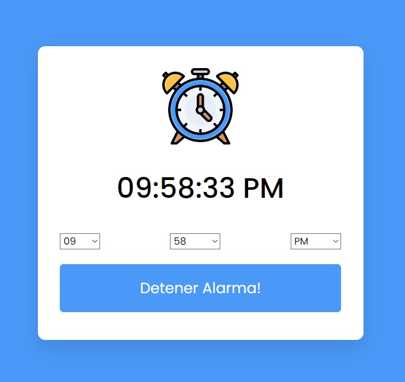

# Reloj-Alarma
un reloj funcional con una alarma hecho en HTML, CSS y JavaScript

  
    
  
    
  
  

## ¿Cuál es el fin de este proyecto?
Este proyecto se creó con fines de aprendizaje usando HTML, CSS y JavaScript. 

## ¿Puedo Probarlo en Linea? 
Si, Puedes probarlo en linea haciendo click [aqui](https://carlosorellana00.github.io/Reloj-Alarma/)

## Metodo de uso:
El reloj se presentara en la pantalla del navegador, con 3 pestañas que indican la hora en un lapso de 12 horas, los minutos y el meridiano 
para seleccionaar AM o PM.

seleccionamos la hora, los minutos y si queremos que sea AM o PM, presinamos el botón "Alarma" y esperamos a que llegue la hora indicada.
para detenerla solamente tenemos que presionar el botón "detener alarma" y para restablecerla "tocar alarma"

## Capturas de Pantallas
 vistas de ejemplo
 
 

  

  

  

  

## Referencias y Agradecimientos a: 
-[Autor Original -> CodingNepal](https://www.codingnepalweb.com)
-[Codigo Fuente -> Build A Simple Alarm Clock in HTML CSS & JavaScript](https://www.codingnepalweb.com/simple-alarm-clock-html-javascript/)

